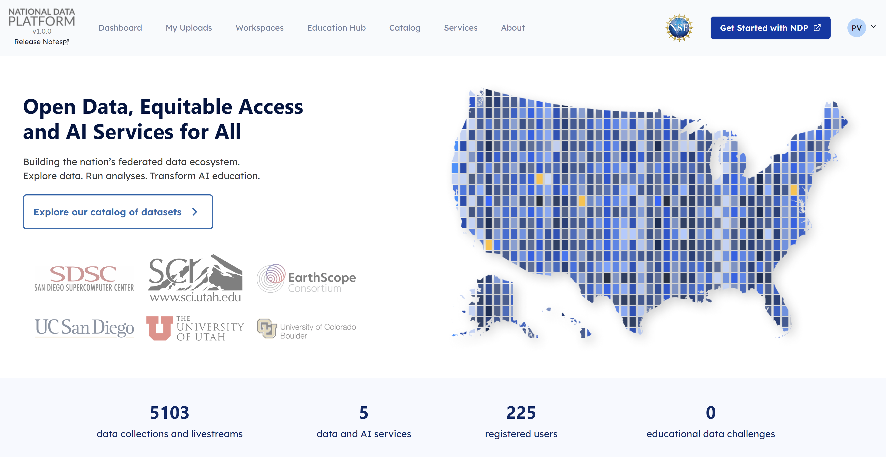
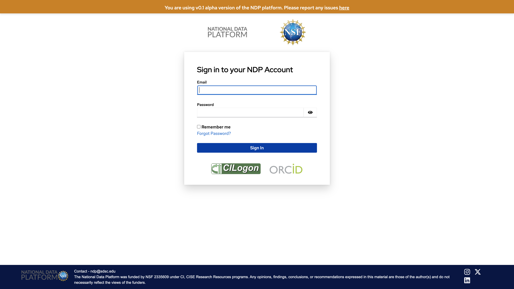
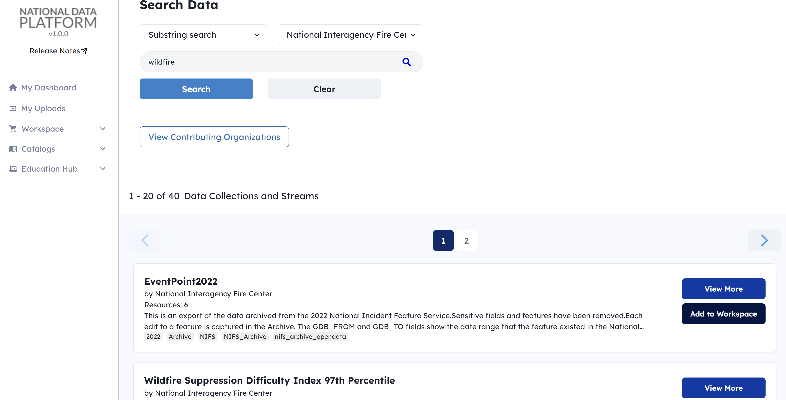
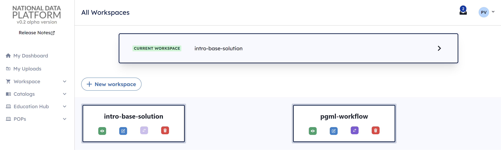
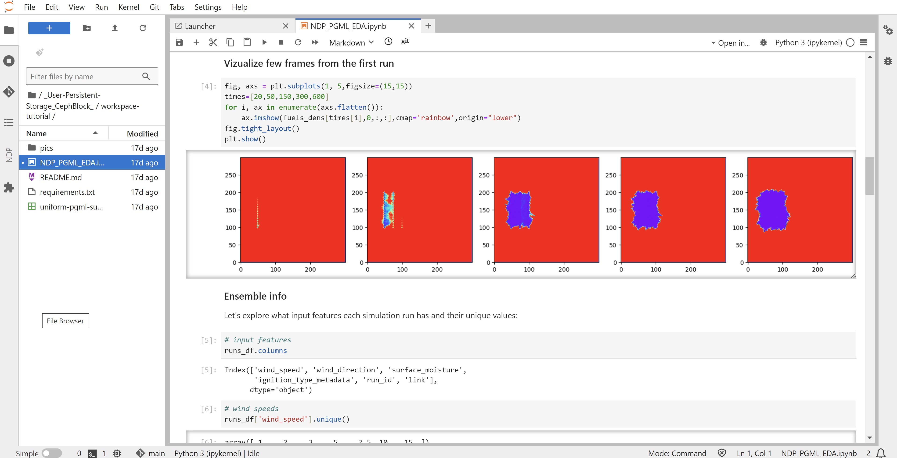

# What is the National Data Platform ? 

The National Data Platform, or NDP, is a federated and extensible data ecosystem to promote collaboration, innovation, and equitable use of data on top of existing cyberinfrastructure capabilities.

NDP is envisioned as a broad data ecosystem to enable data-enabled and AI-integrated research and education workflows.

NDP is aimed to:

- Facilitate [data registration](../catalog/register-data.md), [discovery](../catalog/catalog.md) and usage through a centralized hub
- Enhance distributed CI capabilities through distributed [points of presence](../pop/index.md)   
- Cultivate resources for [classroom education](../ndp-classroom/index.md) and [data challenges](../)
- Assist research and learning through personalized [workspaces](../workspace/index.md)

## Equitable Open Access

With the development of NDP, we aim to address the following questions: 

**Foundational Abstractions and Services**

- What are the foundational data abstractions and services that can serve as multipurpose and expandable building blocks for data-driven and AI-integrated application patterns? 
- How can everyone effectively access and utilize these abstractions and services?

**Equitable and Open CI Use**

- How can such foundational data abstractions and services be developed and deployed on top of existing production-ready CI, including storage and the edge-to-HPC continuum?
- How can we ensure equity of data access and use across distributed CI?

**Needs, Requirements and Challenges**

- What are the requirements and challenges for governance of open science, open data and open CI? 
- What are the required guardrails for protecting privacy, civil rights and civil liberties that will ensure a more equitable use of data systems and services?

## NDP Workflow

**1. Federated access**

Access NDP through your institutional credentials via CI Logon.

**2. Data Discovery and Registration**

Explore a diverse collection of datasets across various scientific domains, and contribute by registering your own data to enhance scientific workflows.

**3. Workspace Design**

Combine multiple data sources and code resources into a unified workspace.

**4. Data Analysis - Processing - AI/ML Workflows Development**

Launch your workspace in JupyterHub to streamline the development of data analysis, processing, and AI/ML workflows.

