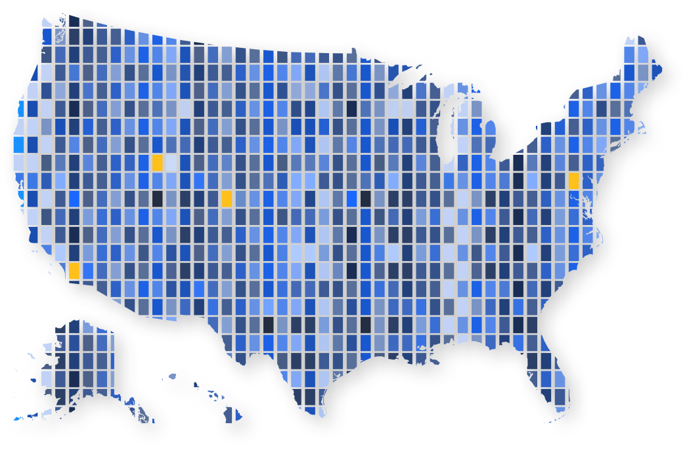
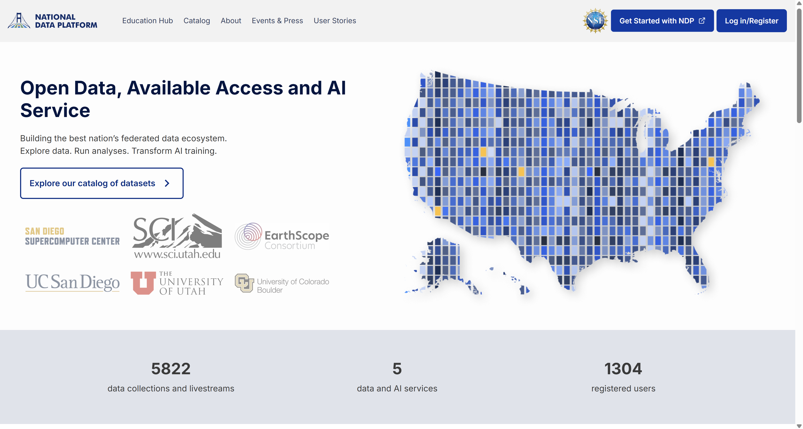

# National Data Platform Documentation

This is the official documentation site for the [National Data Platform (NDP)](https://nationaldataplatform.org/).

## What is the National Data Platform ? 

The National Data Platform, or NDP, is a federated and extensible data ecosystem to promote collaboration, innovation, and use of data on top of existing cyberinfrastructure capabilities.

NDP is envisioned as a broad data ecosystem to enable data-enabled and AI-integrated research and education workflows.

NDP is aimed to:

- Facilitate [data registration](./ndp-catalog/contribute.md), [discovery](./ndp-catalog/explore-data.md) and usage through a centralized hub
- Enhance distributed CI capabilities through distributed [endpoints]()   
- Cultivate resources for [classroom education](./collabstudio/create-classroom.md) and [data challenges](./collabstudio/hosting-a-data-challenge.md)
- Assist research and learning through personalized [workspaces](./quick-start/overview.md)

### Open Access

With the development of NDP, we aim to address the following questions: 

**Foundational Abstractions and Services**

- What are the foundational data abstractions and services that can serve as multipurpose and expandable building blocks for data-driven and AI-integrated application patterns? 
- How can everyone effectively access and utilize these abstractions and services?

**Open CI Use**

- How can such foundational data abstractions and services be developed and deployed on top of existing production-ready CI, including storage and the edge-to-HPC continuum?
- How can we ensure data access and use across distributed CI?

**Needs, Requirements and Challenges**

- What are the requirements and challenges for governance of open science, open data and open CI? 

## Key Features

Some of the key features of NDP are:

**AI-Ready Data** 

NDP provides structured, curated datasets that are optimized for AI projects, allowing users to focus on insights and analysis rather than data preparation.

**Computational Resources**

Integrated high-performance computing (HPC) and cloud resources are available for data processing, machine learning (ML), and deep learning (DL) applications.

**Collaborative Workspace** 

A centralized, web-based interface enables multiple users to work together, sharing resources, tools, and data in real-time.

**Reference Architecture** 

The platform is built on a robust architecture that includes a Centralized Hub for data and computing access, a factory for federated endpoints, and a suite of Standard Services such as authentication, authorization, and orchestration.

**Education Hub**

Hands-on NDP modules and NDP classrooms support open learning and courses that require advanced computational tools, resources, and AI-ready data, enabling students to engage with cyberinfrastructure.

## User Benefits

- **Researchers**: Simplified access to AI tools and data enables researchers to integrate AI and data science into their projects without the overhead of managing complex infrastructure.
- **Educators**: NDP helps educators create AI-centered educational resources and train the next generation through practical, real-world datasets.
- **Students**: Students gain hands-on experience with data projects, developing skills in AI and data science that are critical for academic and professional success.

## Collaborating Institutions

The National Data Platform is a collaborative effort involving the following leading institutions. 

 

  

    
  

  

    
  

  

    
  

  

    
  

  

    
  

  

    
     
     
  

!!! info
    The National Data Platform was funded by NSF 2333609 under CI, CISE Research Resources programs. Any opinions, findings, conclusions, or recommendations expressed in this material are those of the author(s) and do not necessarily reflect the views of the funders.