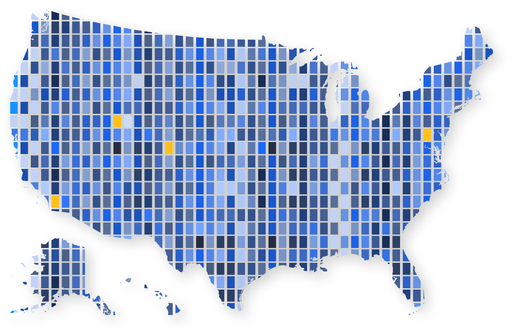
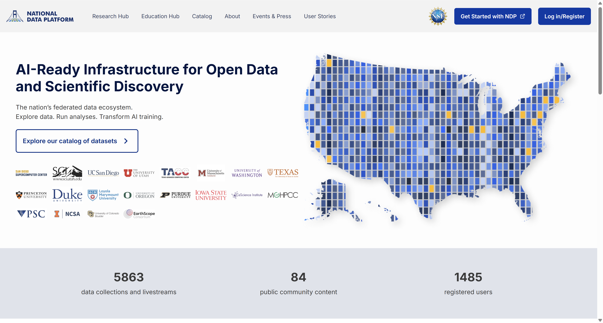

# National Data Platform Documentation

This is the official documentation site for the [National Data Platform (NDP)](https://nationaldataplatform.org/).

## What is the National Data Platform ? 

The National Data Platform, or NDP, is a federated and extensible data ecosystem to promote collaboration, innovation, and use of data on top of existing cyberinfrastructure capabilities.

NDP is envisioned as a broad data ecosystem to enable data-enabled and AI-integrated research and education workflows.

NDP is aimed to:

- Facilitate [data registration](./getting-started/catalog/add-assets.md), [discovery](./getting-started/catalog/search.md) and usage through a centralized hub
- Enhance distributed CI capabilities through distributed [endpoints](./getting-started/endpoints/basics.md)   
- Cultivate resources for [classroom education](./educators/examples.md) and [data challenges](./data-challenge/examples.md)
- Assist research and learning through personalized [workspaces](./getting-started/workspaces/basics.md)

## Value Proposition

With the development of NDP, we aim to address the following questions:

**Foundational Abstractions and Services**

- What are the foundational data abstractions and services that can serve as multipurpose and expandable building blocks for data-driven and AI-integrated application patterns?
- How can everyone effectively access and utilize these abstractions and services?

**Open CI Use**

- How can such foundational data abstractions and services be developed and deployed on top of existing production-ready CI, including storage and the edge-to-HPC continuum?
- How can we ensure data access and use across distributed CI?

**Needs, Requirements and Challenges**

- What are the requirements and challenges for governance of open science, open data and open CI?

## Collaborating Institutions

The National Data Platform is a collaborative effort involving the following leading institutions. 

 

  

    
  

  

    
  

  

    
  

  

    
  

  

    
  

  

    
     
     
  

!!! info
    The National Data Platform was funded by NSF 2333609 under CI, CISE Research Resources programs. Any opinions, findings, conclusions, or recommendations expressed in this material are those of the author(s) and do not necessarily reflect the views of the funders.