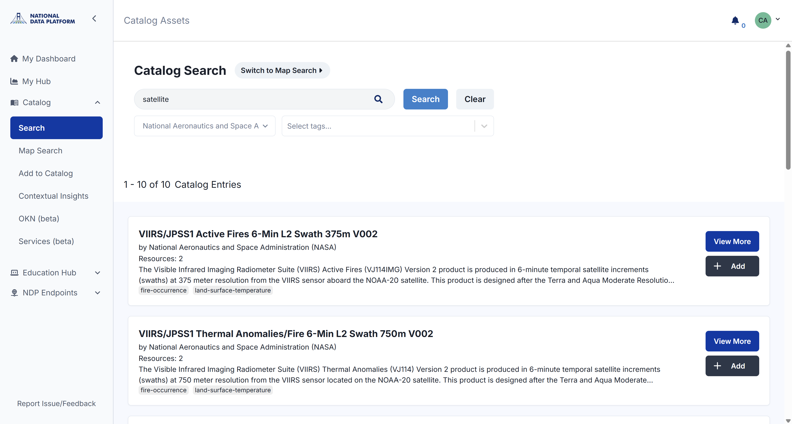
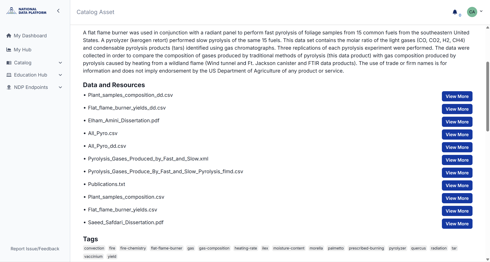

# NDP Catalog 

The NDP Catalog is built through collaboration with organizations and researchers worldwide, who contribute digital assets (including datasets, models, and data services) for open discovery.

Each asset may consist of one or more resources, such as primary files, documentation, codebooks, and schemas, along with any other materials needed for the user to effectively work with the data.

It is important to note that the **NDP Catalog is a metadata catalog, not a data repository. NDP does not store any data**. All assets are hosted by their respective contributors, who are responsible for keeping them accurate and up to date.

To start exploring the catalog and learn what types of resources are available, [see the next page](../ndp-catalog/explore-data.md).

