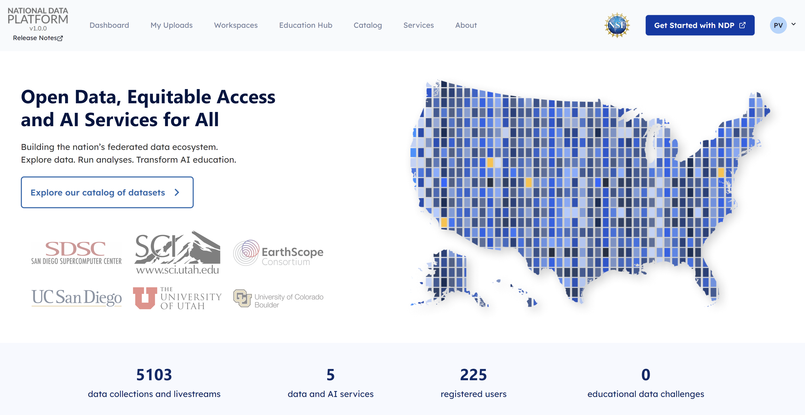

# What is the National Data Platform ? 

The National Data Platform, or NDP, is a federated and extensible data ecosystem to promote collaboration, innovation, and use of data on top of existing cyberinfrastructure capabilities.

NDP is envisioned as a broad data ecosystem to enable data-enabled and AI-integrated research and education workflows.

NDP is aimed to:

- Facilitate [data registration](../explore-data/register-data.md), [discovery](../explore-data/catalog.md) and usage through a centralized hub
- Enhance distributed CI capabilities through distributed [endpoints](../workspace/endpoints/setup.md)   
- Cultivate resources for [classroom education](../education-hub/classroom/set-up.md) and [data challenges](../education-hub/data-challenges/participating-in-data-challenge.md)
- Assist research and learning through personalized [workspaces](../workspace/overview.md)

## Open Access

With the development of NDP, we aim to address the following questions: 

**Foundational Abstractions and Services**

- What are the foundational data abstractions and services that can serve as multipurpose and expandable building blocks for data-driven and AI-integrated application patterns? 
- How can everyone effectively access and utilize these abstractions and services?

**Open CI Use**

- How can such foundational data abstractions and services be developed and deployed on top of existing production-ready CI, including storage and the edge-to-HPC continuum?
- How can we ensure data access and use across distributed CI?

**Needs, Requirements and Challenges**

- What are the requirements and challenges for governance of open science, open data and open CI? 