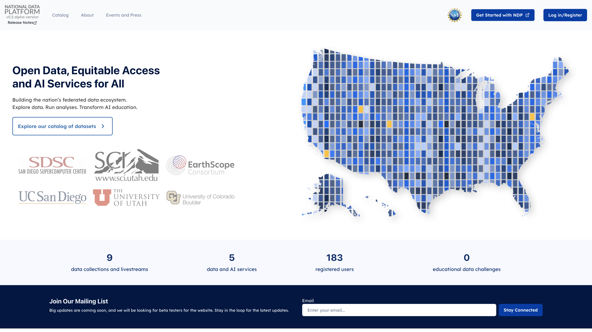
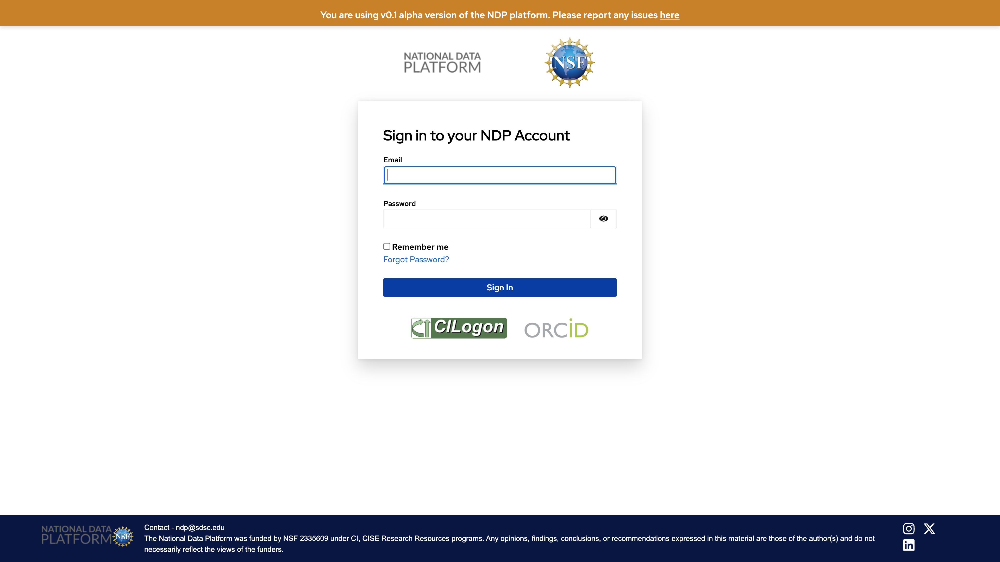
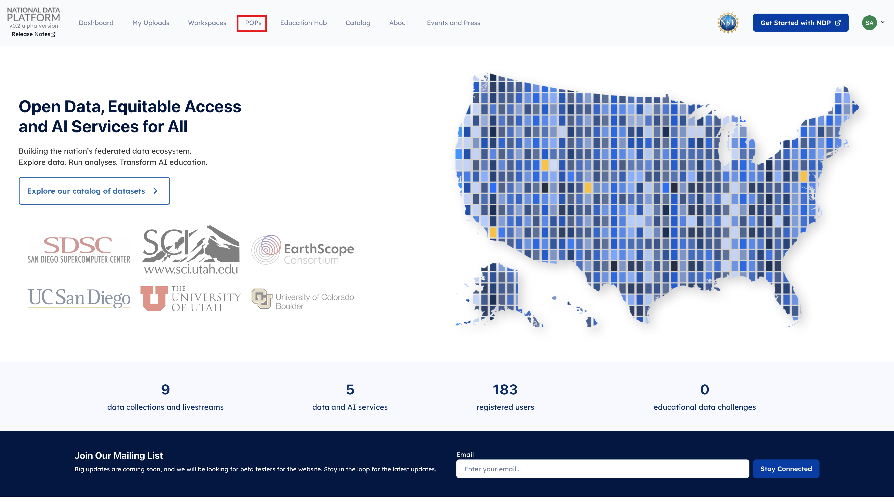
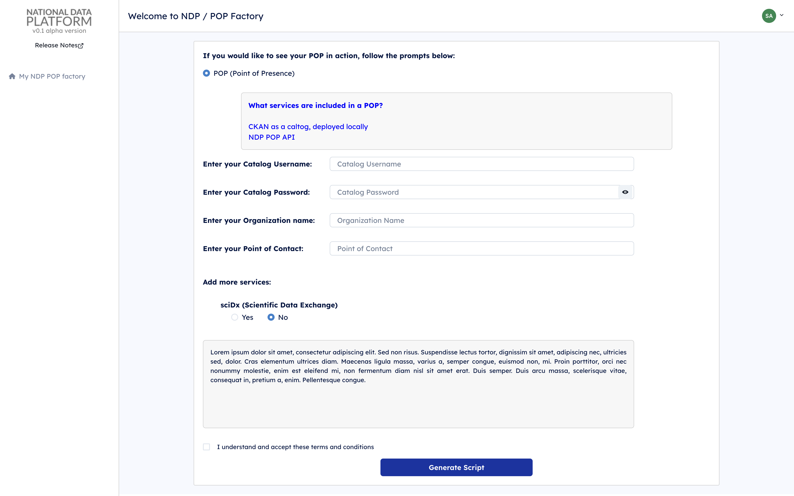
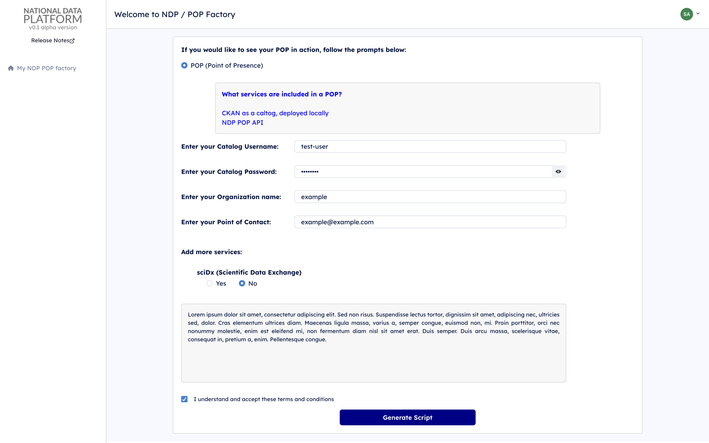
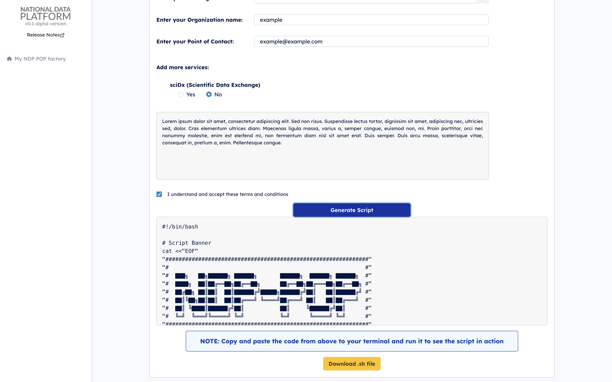

# Generating and Running a POP Setup Script

This guide will walk you through generating a setup script for your Point of Presence (POP) and running it on your infrastructure. Follow these simple steps to get everything up and running smoothly.

## Requirements for Running the Script
- **Sudo privileges**: The script requires **sudo** privileges to execute certain commands. You must be a **sudo** user; otherwise, the script will not run successfully.
- **All necessary packages installed**: Ensure the following tools are installed on your server. The script will not run if any of these tools are missing:
- **jq** (latest version) - [Install jq](https://stedolan.github.io/jq/download/)
  ```bash
  sudo apt-get install jq
  ```
  - **Docker** (latest version) - [Install Docker](https://docs.docker.com/engine/install/)
  - **Docker Compose** (latest version) - [Install Docker Compose](https://docs.docker.com/compose/install/)
  - **unzip** (latest version)
    ```bash
    sudo apt-get install unzip
    ```
  - **PIP** (latest version) - [Install PIP](https://pip.pypa.io/en/stable/cli/pip_install/)
  - **Python 3** (latest version)
  - **Git** (latest version) - [Install Git](https://git-scm.com/book/en/v2/Getting-Started-Installing-Git)
  - **Ports 8000 and 8443** should be open
  - **Write permissions** on the server file system

**Note**: This script has been tested on **Ubuntu 22.04 LTS**. If you plan to run it on other operating systems or Linux distributions, you may need to modify it accordingly.

## Step 1: Access the National Data Platform
Open your web browser and navigate to [nationaldataplatform.org](https://nationaldataplatform.org).

   

## Step 2: Log In
Click on the **Log in/Register** button to sign in with your credentials.

   

## Step 3: Navigate to POPs
Once logged in, locate and click on **POPs** in the sidebar or main navigation to access the NDP POP Factory.

   

## Step 4: Choose POP Setup
 **POP** is selected by default.

   

## Step 5: Fill in the Required Fields
A form will appear asking for specific details:
   - **Catalog Username**: Enter your catalog username.
   - **Catalog Password**: Enter your catalog password.
   - **Organization**: Enter you organization (eg. university of ..., AWS, etc ....)
   - **POC**: Email address of the Point Of Contact
  

   

## Step 6: Generate the Script
Fill in the required fields and click on the **I understand and accept the terms and conditions** to Accept the Terms of Service. Then press on the **Generate Script** button.

   

After a few moments, the setup script will be generated. Copy the script from the generated box or download it.

   

## Step 7: Log in to Your Server
Log into your server where you want to deploy the POP setup. It is recommended to have **sudo** permissions.

## Step 8: Save the Script
On your server, open a text editor (like `nano` or `vim`) and paste the copied script. Save the file as `setup.sh`. Alternatively, you can download the file and copy it from your local machine to the server where the POP will be deployed (e.g., using `scp` or a similar tool).

## Step 9: Run the Setup Script
Run the script by executing the following command:
    ```
    sudo bash setup.sh
    ```
    This will initiate the setup process for your POP environment. It will take around 5-6 minutes to complete the setup and configure all the connections and permissions.


## Accessing the Setup
After the setup completes, you can access the catalog at `http://YourMachinePublicIP:8443` and the POP API at `http://YourMachinePublicIP:8000`.

## Important Note for Non-Sudo Users
you will need to ask your system administrator to run the script as a sudo.

## Information Collected During the Setup Process
During the setup process, the script will collect the following information:

- **Keycloak Information**:
  - **CLIENT_ID**
  - **REALM_NAME**
  - **Token**
  - **Group Name**
  - **Organization**
  - **POC** (Point Of Contact Email)
  - **CKAN URL**
  - **API Key**
  - **POP Value** (whether POP is enabled)
  - **Staging** (whether staging is enabled)

- **System Information**:
  - **Timestamp**
  - **Operating System**
  - **CPU Count**
  - **Total RAM**
  - **Available RAM**
  - **Total Storage**
  - **Available Storage**

This information is used to configure and monitor your POP environment effectively.

## Need Help?
If you encounter any issues, please refer to the documentation provided on the platform or contact support at [saleemalharir1](https://github.com/saleemalharir1).

