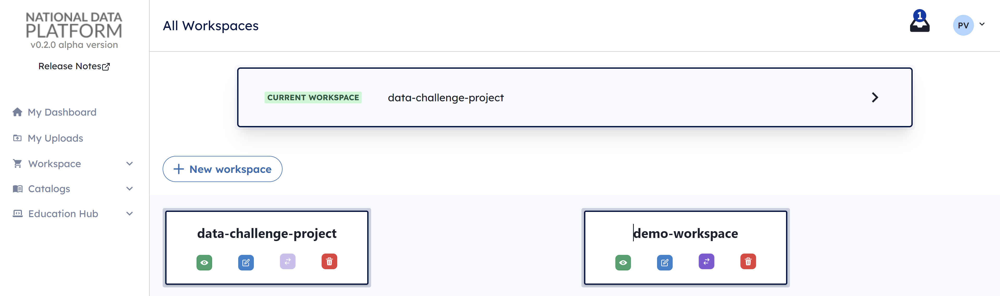

# NDP Workspace

The NDP Workspace is a collaborative environment designed to support a wide range of projects, including AI and Machine Learning (ML) workflows, exploratory data analysis (EDA), scientific research projects and educational projects. Each workspace operates within JupyterHub and provides integration with data resources from NDP Data Catalog and external GitHub repositories. 

## Key Features of the NDP workspace

#### Collaborators

The NDP Workspace enables collaboration across projects by allowing users to invite team members or colleagues. Collaborators can be assigned specific roles with varying permissions. 

#### Data from NDP Catalog

The NDP Workspace supports the addition of data resources from the NDP data catalog, making it easy for users to find and utilize datasets relevant to their project. 

#### GitHub Integration

With GitHub integration, the NDP Workspace allows users to connect to external repositories, ensuring that source code, configuration files, and dependencies are easily managed. 
